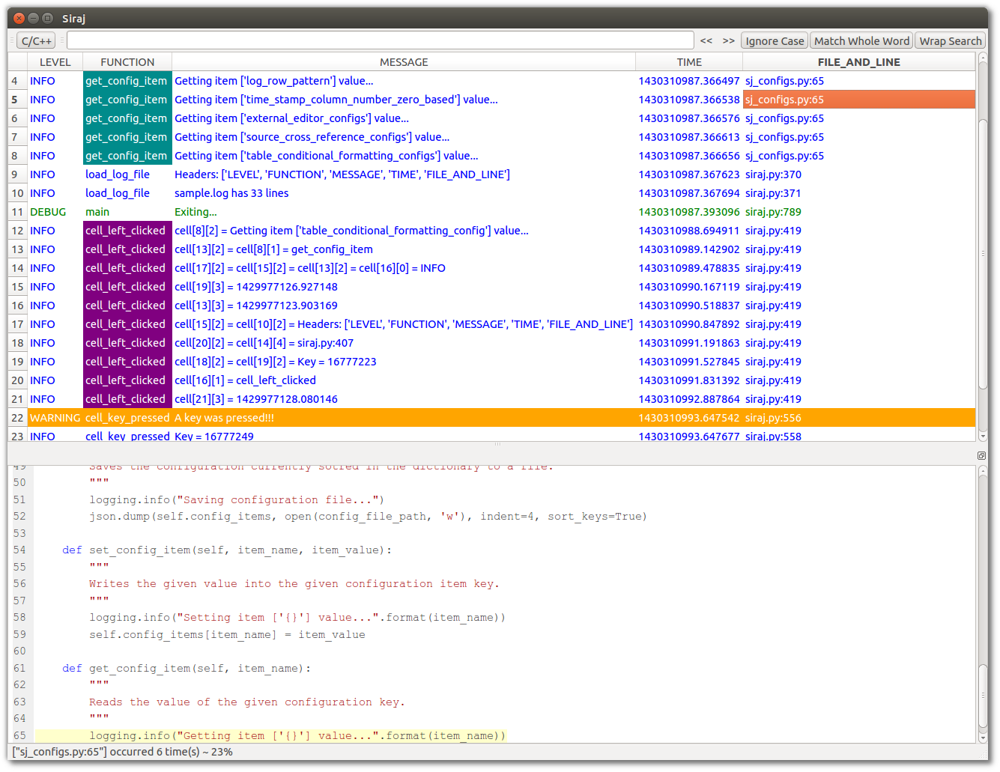

*Siraj* is a cross-platform textual log parser that was built using Python3 and QT
 

# Problem
Textual logs can sometimes be huge. And going through them with standard text 
editor without color coding or filtering can be really frustrating job.

# Solution [as offered by *Siraj*]
*Siraj*  aims to facilitate textual logs analysis by presenting the textual
log in a user-friendly tabular format, it also allows the user to show/hide rows 
based on their contents.

# Quick feature list
1.  Parsing any textual log and present matched fields as a **tabular format**.
2.  Matching logs is based on **Regular Expressions** for maximum flexibility.
2.  **Conditionally formatting** the table cells foreground/background colors based on the contents.
3.	**Hiding** one or more rows based on the contents.
4.	**Showing** only specific rows and hiding everything else.
5.  **Cross-referencing the source code** file/line that generated the log if applicable.
6.	Calculating the **time difference** between any two rows in the table if applicable.

# Running Siraj
## From the source (Preferred method)

Before you use *Siraj* you'll need to install and configure the following based
on your target system:

1.  [Python3](https://www.python.org/downloads/). 
2.  [SIP](http://www.riverbankcomputing.com/software/sip/download).
3.  [PyQt4](http://www.riverbankcomputing.com/software/pyqt/download).

Once you have the prerequisites you can run the tool using it's main module as
follows:

`python siraj.py` 

## From the binaries
If you only need to use the tool and don't have/need python or Qt, you can 
download one of the following archives based on your system. 

1.	[Linux.](https://github.com/embedded-slam/siraj/raw/10fa334951a4d384e28e5f4cc48dac8556055029/release/linux/siraj_linux.tar.gz)
2. 	Windows. _Comming soon!_ 
3.	Mac.  _Comming soon!_  

Once downloaded, you'll need to extract it and run *sirag*. This will run with 
the provided sample log `sample.log` and the provided sample configuration 
`siraj_configs.json`. You can then fine tune the configuration and load the 
log of your choice.
